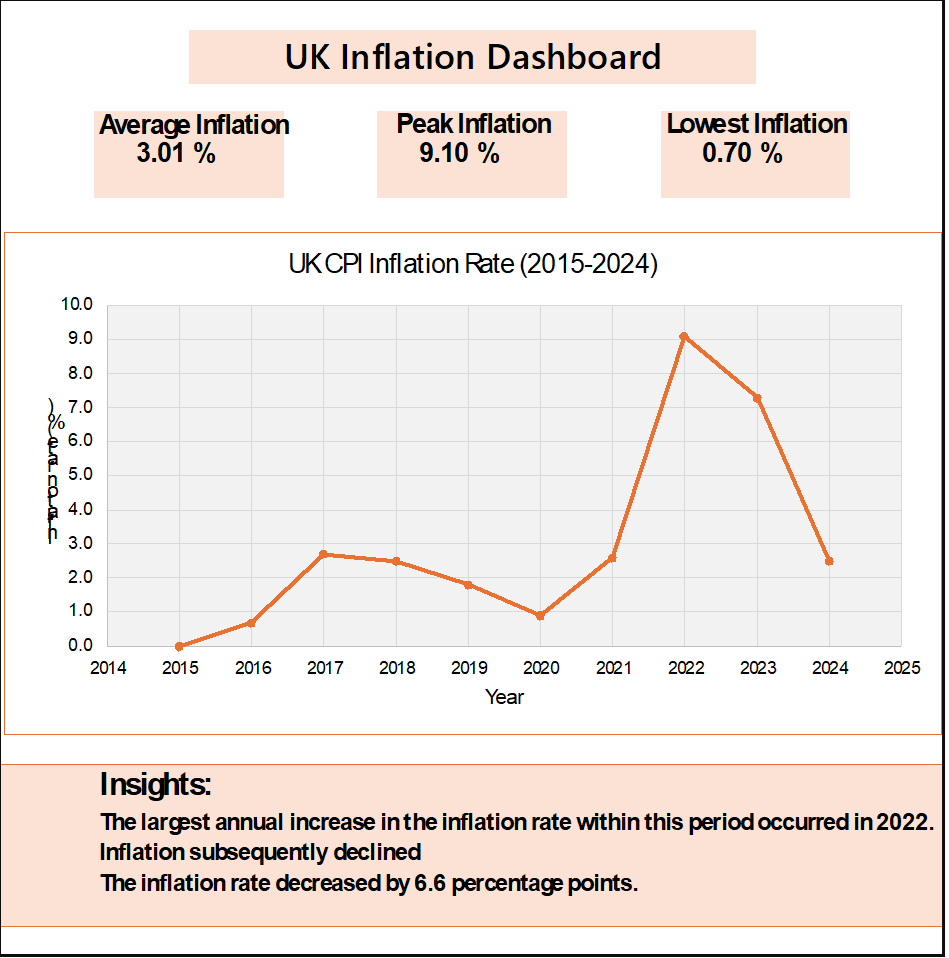

# UK Inflation Tracker

## Project Overview

This project analyses the annual UK Consumer Price Index (CPI) inflation rate from 2015 to 2024.

The objective is to identify major inflation trends, periods of significant increases and declines, and key changes in the UK inflation rate over the period.

## Research Questions

- How did UK CPI inflation change between 2015 and 2024?
- When did inflation reach its highest level?
- What was the lowest inflation rate during the period?
- How did inflation change following the 2022 peak?

## Data

The dataset is based on UK Consumer Price Index (CPI) inflation data published by the Office for National Statistics (ONS).

The raw dataset is stored in:

`data/ONS_CPI_D7G7_Raw.csv`

## Tools Used

- Microsoft Excel
- Pivot Tables
- Excel formulas
- Data visualisation
- GitHub
- GitHub Desktop

## Analysis

The analysis was conducted using Microsoft Excel.

Key metrics calculated include:

- Average inflation rate
- Peak inflation rate
- Lowest inflation rate
- Annual changes in inflation
- Trend analysis

## Dashboard



## Key Findings

- The highest inflation rate during the period occurred in 2022.
- Inflation subsequently declined after the 2022 peak.
- The inflation rate decreased by approximately 6.6 percentage points between 2022 and 2024.
- The period demonstrates substantial variation in UK inflation, particularly during the 2021–2022 period.

## Project Structure

```text
UK-Inflation-Tracker/
│
├── data/
│   └── ONS_CPI_D7G7_Raw.csv
│
├── analysis/
│   └── UK_Inflation_Analysis.xlsx
│
├── visualizations/
│   └── UK_Inflation_Dashboard.png
│
├── README.md
└── .gitattributes
